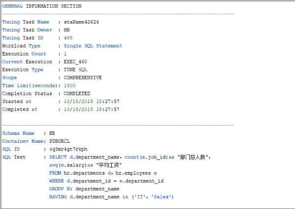
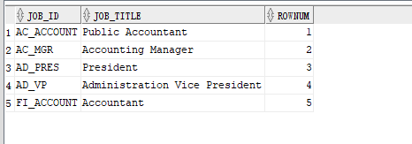

# 实验一：分析SQL执行计划，执行SQL语句的优化指导

## 实验内容：
- 对Oracle12c中的HR人力资源管理系统中的表进行查询与分析。
- 首先运行和分析教材中的样例：本训练任务目的是查询两个部门('IT'和'Sales')的部门总人数和平均工资，以下两个查询的结果是一样的。但效率不相同。
- 设计自己的查询语句，并作相应的分析，查询语句不能太简单。

## 教材中的查询语句

-查询1：

```SQL
SELECT d.department_name，count(e.job_id)as "部门总人数"，
avg(e.salary)as "平均工资"
from hr.departments d，hr.employees e
where d.department_id = e.department_id
and d.department_name in ('IT'，'Sales')
GROUP BY department_name;
```
运行结果：


- 查询2：
```SQL
SELECT d.department_name，count(e.job_id)as "部门总人数"，
avg(e.salary)as "平均工资"
FROM hr.departments d，hr.employees e
WHERE d.department_id = e.department_id
GROUP BY department_name
HAVING d.department_name in ('IT'，'Sales');
```
运行结果：


比较：我认为第一条语句较为优。第一句有嵌套循环的扫描方式，用了索引扫描的方式且内存用的最少。

- 自定义：
查询所有工作里工资大于3000的并以5页为单位进行分页，当前显示了第一页
主要思想为将查询语句视为一张表，查询这个表里所有的内容和rownum这个关键字
最后再限定rownum的范围

```sql
select t.*,rownum 
from (
select j.job_id,j.job_title 
from hr.jobs j 
where j.min_salary>3000 
order by j.job_id) t 
where rownum>0 and rownum<=5
```

运行结果：


